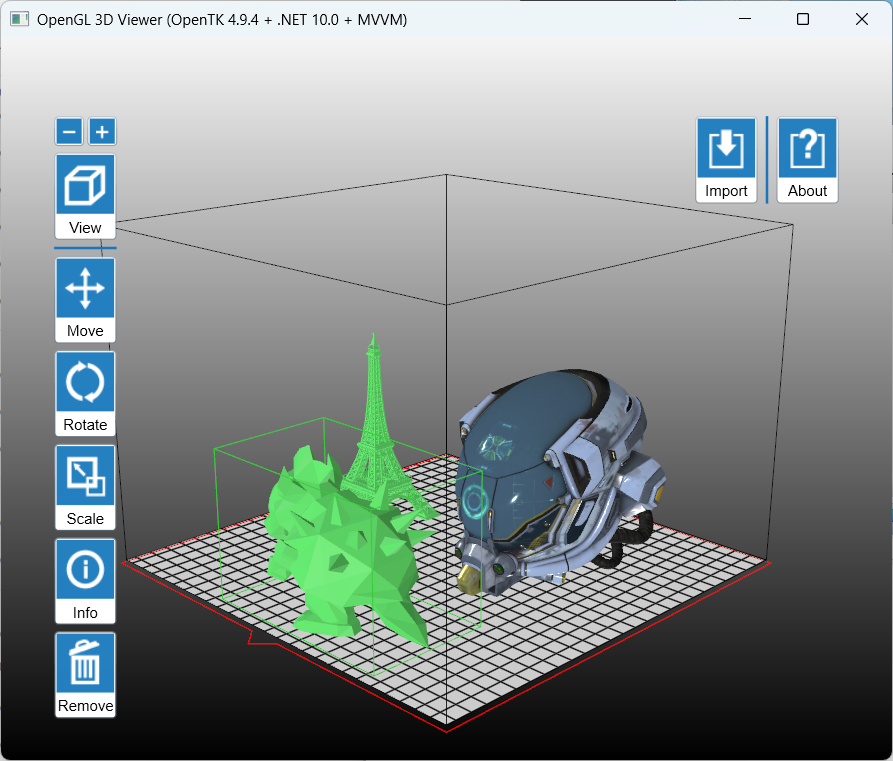

# OpenGL 3D Viewer

  

A Windows desktop 3D model viewer built with WPF, OpenTK, and OpenGL. The project combines a WPF control surface with an OpenTK rendering window to inspect mesh geometry, adjust placement, and preview models in a print-bed style workspace.

## Highlights

- Load and inspect `STL` and `GLB` models.
- Orbit, pan, and zoom the camera in real time.
- Move, rotate, scale, reset, and clone loaded models.
- Show a printer-bed volume to check model fit against configured build dimensions.
- Open a model from the command line or by using the in-app import workflow.

## Tech Stack

- C#
- .NET 10
- WPF for the desktop UI
- OpenTK `4.9.4` for OpenGL integration

## Requirements

To build and run the project, you will need:

- Windows 10 or later
- .NET 10 SDK
- Visual Studio with WPF and .NET desktop development support

## Getting Started

### Build in Visual Studio

1. Clone the repository.
2. Open `OpenGL3DViewerMVVM.slnx` in Visual Studio.
3. Restore packages and build the solution.
4. Run the project.

## Usage Notes

- The viewer opens sample assets from the `Testfiles` folder, including both `STL` and `GLB` examples.
- Viewer settings are persisted under the current user's application data folder.

## Project Structure

- `Draw/` OpenGL drawing and render helpers
- `MeshIOLib/` mesh loading code for supported file formats
- `ModelLib/` geometry, model, and utility types
- `View/` WPF windows and UI panels
- `Resources/` icons, images, and localization assets
- `Testfiles/` sample models for quick testing

## Credits

Created by Charles Chang (charles.chang@live.com).

Third-party library:

- [OpenTK](https://opentk.net/)

## License

This project is licensed under the MIT License.
